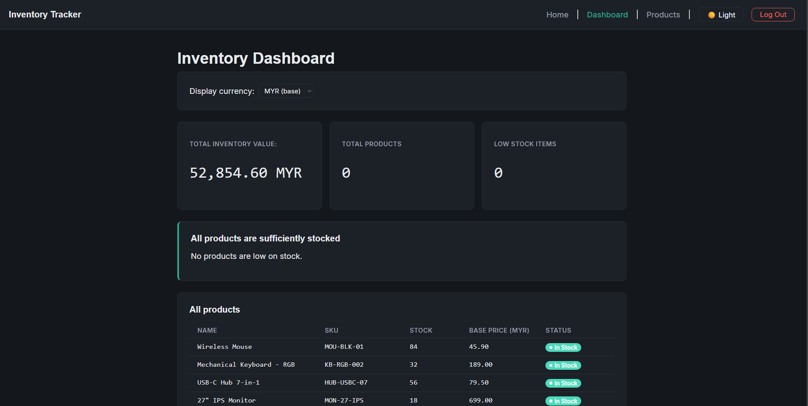
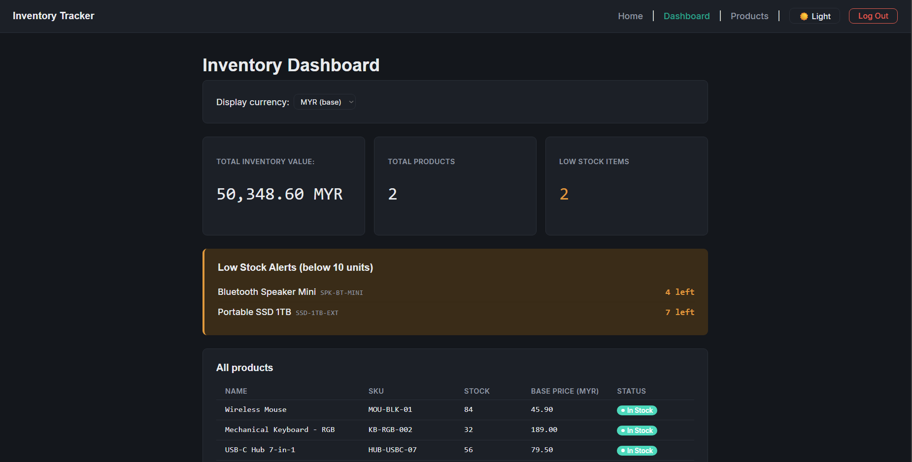
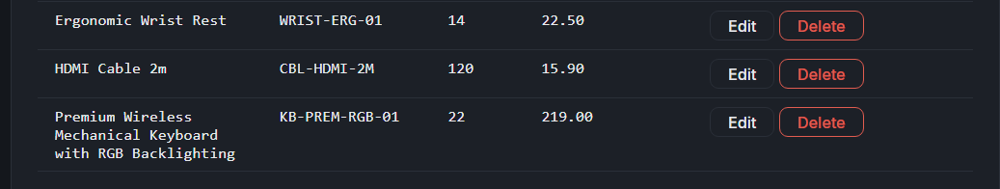

# Small Business Inventory Tracker

A full-stack inventory management system built for a single authenticated business owner to track products, manage stock levels, and view pricing across currencies.

Built as a practice project to learn end-to-end authentication, REST API design, and production-style frontend/backend hardening.

## Features

- **Authentication** — secure login/logout via Auth0, with protected routes on both frontend and backend
- **Product Management** — full CRUD (create, read, update, delete) with server-side validation
- **Live Currency Conversion** — view any product's price converted into a selected foreign currency, using live exchange rates
- **Inventory Dashboard** — total inventory value, low-stock alerts, and a full product overview
- **Dark / light theme** — with system-preference detection and persistence across sessions

## Tech Stack

**Frontend:** React, Vite, React Router, SCSS, Framer Motion, Auth0 React SDK
**Backend:** Flask, SQLAlchemy, SQLite, joserfc (JWT verification)
**Auth:** Auth0 (SPA Application + API, RS256, PKCE flow)
**External API:** [Frankfurter](https://frankfurter.app) for live currency exchange rates

## Prerequisites

- Node.js and npm
- Python 3.10+
- An [Auth0](https://auth0.com) account (free tier is sufficient)

## Setup

### 1. Clone the repository

```
git clone <your-repo-url>
cd inventory-tracker
```

### 2. Auth0 configuration

You'll need two things set up in your Auth0 dashboard:

- **An Application** (type: Single Page Application) — note its **Domain** and **Client ID**
- **An API** (signing algorithm: RS256) — note its **Identifier**, and add `http://localhost:5173` to the Application's Allowed Callback URLs, Allowed Logout URLs, and Allowed Web Origins

### 3. Backend setup

```
cd backend
python -m venv venv
venv\Scripts\activate      # Windows
pip install -r requirements.txt
```

Create `backend/.env`:

```
AUTH0_DOMAIN=your-tenant.us.auth0.com
AUTH0_API_AUDIENCE=https://your-api-identifier
FLASK_DEBUG=true
```

### 4. Frontend setup

```
cd frontend
npm install
```

Create `frontend/.env`:

```
VITE_AUTH0_DOMAIN=your-tenant.us.auth0.com
VITE_AUTH0_CLIENT_ID=your-client-id
VITE_AUTH0_API_AUDIENCE=https://your-api-identifier
```

### 5. Install root dev dependencies

From the project root:

```
npm install
```

This installs `concurrently`, which lets both servers start together with one command.

## Running the app

From the project root:

```
npm run dev
```

This starts both the Flask backend (`http://localhost:5000`) and the Vite frontend (`http://localhost:5173`) together, with labeled, color-coded output for each.

Visit `http://localhost:5173` and log in.

## Project Structure

```
inventory-tracker/
├── backend/
│   ├── app.py              # Flask app entry point, config
│   ├── auth.py             # JWT verification (joserfc)
│   ├── models.py           # SQLAlchemy Product model
│   ├── routes.py           # Product CRUD + currency conversion endpoints
│   ├── extensions.py       # Shared SQLAlchemy db instance
│   └── requirements.txt
├── frontend/
│   ├── src/
│   │   ├── hooks/          # useProducts, useCurrencyRate, useTheme
│   │   ├── utils/          # formatPrice, formatCurrency
│   │   ├── styles/         # SCSS partials (tokens, base, nav, layout, table, dashboard, home)
│   │   ├── Home.jsx
│   │   ├── Products.jsx
│   │   ├── Dashboard.jsx
│   │   ├── ProductRow.jsx
│   │   ├── AddProductForm.jsx
│   │   ├── Nav.jsx
│   │   └── Auth0ProviderWithNavigate.jsx
│   └── package.json
└── package.json            # Root script to run both servers together
```

## Screenshots

**Dashboard — healthy inventory**


**Dashboard — low stock alerts**


**Responsive table with a long product name**


Long product names wrap cleanly within their column instead of breaking the table layout or spilling into adjacent columns.

**Protected routes with correct post-login redirect**


Visiting a protected route while logged out redirects to Auth0 login — and after logging in, lands back on the originally requested page, not a generic home screen.

**Dark / light theme transition**


## Technical Highlights

### Backend: protecting every route with real token verification

```python
def requires_auth(f):
    @wraps(f)
    def decorated(*args, **kwargs):
        auth_header = request.headers.get("Authorization", None)

        if not auth_header:
            return jsonify({"error": "Authorization header missing"}), 401

        parts = auth_header.split()
        if parts[0].lower() != "bearer" or len(parts) != 2:
            return jsonify({"error": "Invalid Authorization header format"}), 401

        token = parts[1]
        try:
            claims = verify_token(token)
        except JoseError:
            return jsonify({"error": "Invalid or expired token"}), 401

        request.auth_claims = claims
        return f(*args, **kwargs)
    return decorated
```

Every product endpoint verifies the request's JWT — checking signature, audience, and issuer against Auth0's public keys — before any database logic runs. No route trusts the frontend's auth state alone.

### Frontend: avoiding a race condition on rapid currency switching

```js
useEffect(() => {
  if (!selectedCurrency) {
    setRate(null);
    return;
  }

  const controller = new AbortController();

  async function loadRate() {
    setRateLoading(true);
    setRate(null);
    try {
      const token = await getAccessTokenSilently();
      const data = await apiFetch(`/convert?to=${selectedCurrency}`, token, {
        signal: controller.signal
      });
      setRate(data.rate);
    } catch (err) {
      if (err.name === "AbortError") return;
      setRateError(err.message);
    } finally {
      if (!controller.signal.aborted) setRateLoading(false);
    }
  }

  loadRate();
  return () => controller.abort();
}, [selectedCurrency, getAccessTokenSilently]);
```

If a user switches currencies quickly, an older in-flight request could resolve after a newer one and overwrite it with stale data. `AbortController` cancels the previous request the instant a new one starts, so the displayed rate always matches the currently selected currency.

## Scope

This project intentionally does not include: multi-user accounts, payment processing, cloud hosting, a mobile app, automated restocking/supplier integration, or historical reporting. See the original project documentation for full scope boundaries.
